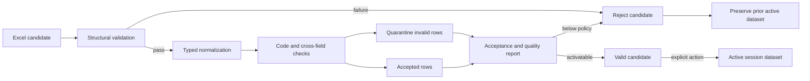

# Data ingestion contract 1.3 with referral-network extension

## Purpose

This document defines the executable data foundation for the ENSIA617 HEC
role-based dashboard. It implements the Day 1 session architecture without
creating the Streamlit application. The foundation covers a controlled Excel
workbook, simulated operational and professional data, public establishment
reference data, deterministic validation, row quarantine, and explicit
in-memory activation.

The prototype remains an academic BI and decision-support layer. It does not
ingest real patient or employee identifiers, patient addresses, clinical
documents, or patient-level records.

## Packaged inputs

| Input | Grain | Packaged rows | Purpose |
|---|---|---:|---|
| `DERIVACIONES` | One simulated referral episode | 3,400 | Clinical demand, waiting, attendance, pertinence, counter-referral, GES, and teleconsult measures |
| `CIRUGIAS` | One simulated surgical case | 2,200 | Surgical waiting, completion, suspension, ambulatory status, and operating-room measures |
| `ACTIVIDAD_PROF` | One simulated professional activity | 3,360 | Separate clinical and surgical profile lenses without a combined score |
| `LISTA_ESPERA_AMB` | One simulated episode at a quarterly snapshot | 6,240 | New-consultation queue, due follow-up controls, aging, scheduling and resolution |
| DEIS establishment snapshot | One public establishment | 55 | Origin-code validation and establishment-level georeferencing |

All operational records are synthetic. Their identifiers identify simulated
episodes or activities, never people. The deterministic generator uses seed
`617`, covers January through June 2026, and can be rerun with
`scripts/generate_simulated_data.py`. DEIS code `111101` identifies Hospital El
Carmen itself and is excluded from the eligible external-origin pool. If a
compatible user upload includes that code as an origin, validation preserves
the accepted row and the quality page classifies it transparently as internal;
only external-network maps, rankings, center selectors, tables, and downloads
exclude it.

## Workbook contract

The normative machine-readable definition is
`config/data_contract.json`. The delivered workbook is
`templates/plantilla_carga_hec_1_3.xlsx`. The map remediation raises the
contract to `1.3.0`. Contracts 1.1 and 1.2 remain loadable: 1.1 may omit the
waitlist sheet and 1.2 may omit the referral-diagnosis field. Missing legacy
dimensions report `unavailable`, never zero.

| Sheet | Status | Rule |
|---|---|---|
| `INSTRUCCIONES` | Informational | Spanish user guidance, simulation warning, privacy boundary, and activation behavior |
| `METADATOS` | Required | Exact key/value contract, data period, simulation notice, and DEIS snapshot ID |
| `DERIVACIONES` | Required | Exact ordered columns from the contract; clinical MVP service scope |
| `CIRUGIAS` | Required | Exact ordered columns from the contract; surgical MVP service scope |
| `ACTIVIDAD_PROF` | Required | Explicit `profile_type` and `lens`; mixed profiles use separate rows; `elective_major_applicable_flag` defines the professional ambulatory-surgery denominator |
| `LISTA_ESPERA_AMB` | Required in 1.2–1.3 | Exact 18-column schema in 1.3; stores the governed `referral_diagnosis_id`, separates `queue_entry_date` from `control_due_date`, and validates dates against snapshot and status |
| `CATALOGOS` | Informational | Approved unit, specialty, DEIS establishment, and simulated referral-diagnosis codes |

Dates use ISO `YYYY-MM-DD`. Boolean fields accept `SI` or `NO`. The validator
also supports ordinary Excel date serials for metadata timestamps because
spreadsheet software may store visually formatted dates as numeric values.
Unknown or reordered columns are structural errors rather than silently mapped
fields.

## Reference snapshot provenance

The separate DEIS ETL project was inspected and consumed read-only with explicit
user authorization. No ETL code or data was modified. The dashboard snapshot is
derived from two already validated products:

| Upstream role | File | SHA-256 |
|---|---|---|
| CURATED national master | `establecimientos_curated.csv` | `ef1275e3de19ea04a8b087ddd36c1f0a059618a0a927f6fb5f829c7fb5390742` |
| HEC service selection | `hec_servicio_salud_vigentes.csv` | `b0c4073e8e40b1885f2193203ff245897c546717aabf85a7388ac23610e4cbc4` |
| CURATED quality manifest | `curated_manifest.json` | `a81ddc37a0b7280fead29dc43a04a088f9cc4e9b7a0edd65cb141d0e61dd1e4e` |

The upstream manifest reports 45 passing checks, 3 retained warnings, and no
blocking failure. The source cut is 2026-08-25 and ETL version is `0.1.0`.
The dashboard packages 55 unique establishments, all with coordinates. The
snapshot and complete provenance are recorded in:

- `data/reference/deis_establishments_ssmc_snapshot.csv`
- `data/reference/deis_snapshot_manifest.json`

The dashboard has no runtime dependency on the DEIS project. Updating the
snapshot is an explicit, reviewable operation using
`scripts/build_deis_snapshot.py` with input paths supplied by the operator.

## Validation and normalization

Structural validation checks sheet presence, exact column order, metadata, and
contract version. Row validation checks:

- primary-key uniqueness;
- ISO dates and metadata-period containment;
- nonnegative integer and numeric values;
- approved enums and Boolean values;
- MVP-enabled service codes;
- specialty-to-service parent relationships;
- professional lens-to-service consistency;
- explicit surgical professional applicability before ambulatory-major status;
- origin codes against the packaged DEIS snapshot;
- diagnosis IDs against `config/referral_diagnoses.json` and their declared
  analytical specialty;
- flag consistency for attendance, GES, ambulatory surgery, professional
  activity, and operating-room hours.

Invalid rows retain their source row, raw values, issue code, field, and
actionable message in the in-memory quarantine result. They never enter the
candidate's accepted tables.

## Activation invariant

The validation policy requires:

- no structural errors;
- at least one accepted row in every data sheet;
- 100% completeness of critical fields in accepted rows;
- at least 95% accepted rows across submitted data.

Submission and activation are separate operations. A valid upload creates a
candidate but does not alter the active dataset. Only
`activate_candidate()` performs an atomic deep-copy transition. A rejected
upload clears the candidate, records its report, and preserves the prior active
dataset unchanged.

The implementation uses ordinary process memory and is intended for future
Streamlit session state. It is not durable storage or a secure vault. Uploaded
workbooks must not be written to the repository, database, or durable hosting
path.

## Privacy and interpretation controls

- Source mode is restricted to `simulado` for the academic prototype.
- Real patient and employee identifiers are prohibited.
- Patient addresses and patient-level drill-down are prohibited.
- Professional profiles are fictional keys and cannot be used for public
  ranking or punitive scoring.
- A mixed profile is represented by separate clinical and surgical rows.
- Clinical professional rows cannot enter the elective-major denominator;
  `ambulatory_major_flag` requires `elective_major_applicable_flag`.
- DEIS coordinates identify establishments only.
- Geographic outputs must suppress cells below 10 records.
- Missing, inapplicable, and denominator-zero results remain unavailable; they
  are never replaced with zero.

## Verification

Run:

    ./.venv/bin/python scripts/validate_contracts.py
    ./.venv/bin/python scripts/validate_data_contract.py \
      --workbook templates/plantilla_carga_hec_1_3.xlsx
    ./.venv/bin/python -m unittest discover -s tests -p 'test_*.py' -q

Acceptance requires the packaged simulation and workbook to report 15,200 accepted
rows, zero quarantined rows, 100% acceptance, 55 valid DEIS codes, and a passing
test suite.
